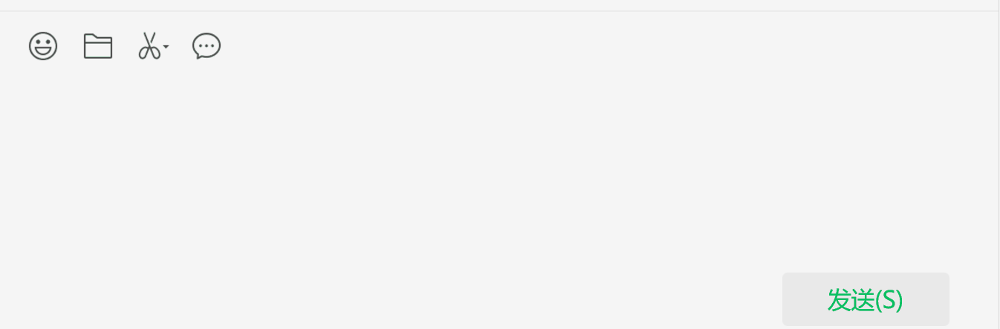

# SpaceTrans .NET CLI

> 🇨🇳 [中文文档 README-CN.md](README-CN.md)

A .NET console and tray application that provides instant translation with double-space hotkey activation.



## Features

- **Global hotkey detection** (double space)
- **Automatic text translation** with intelligent content detection
- **Multiple translation engines** (Youdao API, Google Gemini)
- **System tray integration** with visual status indicators
- **Cross-platform support** (Windows focused)
- **Configurable settings** with GUI interface

## Requirements

- .NET 8.0 or higher
- Windows (for global hotkey functionality)

## Usage

### Tray Mode (Default)
```bash
SpaceTrans-Tray.exe
```
- Runs in system tray
- Double-click tray icon for settings
- Right-click for menu options

### Console Mode
```bash
SpaceTrans-CLI.exe
```
- Runs in console with text output
- Useful for debugging and logging

### Quick Translation
1. Select any text in any application
2. **Double-press Space** to translate selected content
3. Translation automatically replaces selected text

## Configuration

### First Run Setup
1. Double-click tray icon to open settings
2. Configure your preferred translation engine:
   - **Youdao**: Requires App Key and App Secret
   - **Gemini**: Requires Google API Key
3. Set target language (en, zh, ja, ko, fr, de, es, ru)
4. Test connection to verify configuration

### Configuration File
Settings are stored in `config.json`:
```json
{
  "CurrentEngine": "Gemini",
  "TargetLanguage": "en",
  "YoudaoConfig": {
    "AppKey": "your-app-key",
    "AppSecret": "your-app-secret"
  },
  "GeminiConfig": {
    "ApiKey": "your-api-key"
  }
}
```

## Build

### Development Build
```bash
dotnet build
```

### Release Build
```bash
dotnet build -c Release
```

### Self-Contained Executable
```bash
dotnet publish -c Release -r win-x64 --self-contained true -p:PublishSingleFile=true
or
# CLI
dotnet msbuild -t:ReleaseCli
# Tray
dotnet msbuild -t:ReleaseTray
# Tray, but requires .NET 8
dotnet msbuild -t:ReleaseTray-net8
```

## Custom Icon

Place your custom `icon.ico` file in the application directory, or embed it as a resource in `Resources/icon.ico`.

## System Tray Features

- **Visual status indicators**: Icon changes during translation
- **Silent operation**: No popup notifications in tray mode
- **Context menu**: Quick access to all functions
- **Settings GUI**: Easy configuration management
- **Automatic logging**: All events logged to file
- **Log file access**: Right-click menu to open log file directly

## Logging

SpaceTrans automatically logs all activities to help with debugging and monitoring:

### Log Locations
- **Tray Mode**: `%LOCALAPPDATA%\SpaceTrans\app.log`
- **Console Mode**: `%LOCALAPPDATA%\SpaceTrans\console.log`

### Log Levels
- **Tray Mode**: Info level and above
- **Console Mode**: Debug level and above (more verbose)

### Log Features
- **Automatic rotation**: Logs rotate when they exceed 10MB
- **Timestamped entries**: Each log entry includes precise timestamp
- **Thread-safe**: Safe for concurrent operations
- **Translation tracking**: Detailed translation request/response logging

### Example Log Entry
```
[2024-12-08 14:30:25.123] [Info] [T1] Translation successful [Gemini]: 'Hello world...' -> '你好世界...'
```

## Keyboard Shortcuts

- **Double Space**: Translate selected text
- **Tray Menu**: Toggle hotkey on/off, open log file, access settings
- **Double-click Tray Icon**: Open settings directly

## Translation Engines

### Youdao API
- High-quality translations
- Supports multiple language pairs
- Requires API credentials from Youdao

### Google Gemini
- AI-powered translations
- Natural language processing
- Requires Google AI API key

## Troubleshooting

### Hotkey Not Working
- Check if hotkey is enabled in tray menu
- Verify Windows permissions for global hooks
- Run as administrator if needed
- Check logs for hotkey installation errors

### Translation Errors
- Verify API credentials in settings
- Test connection using built-in test feature
- Check internet connectivity
- Review logs for detailed error information

### Configuration Issues
- Delete `config.json` to reset to defaults
- Ensure API keys are correctly entered
- Verify target language is supported
- Check logs for configuration loading errors

### Logging Issues
- Logs are stored in `%LOCALAPPDATA%\SpaceTrans\`
- Log files automatically rotate at 10MB
- Console mode provides more detailed debug logging
- Check file permissions if logs aren't being written

## Version
- **Current Version**: 1.0.0
- **Framework**: .NET 8.0
- **Platform**: Windows 7.0+